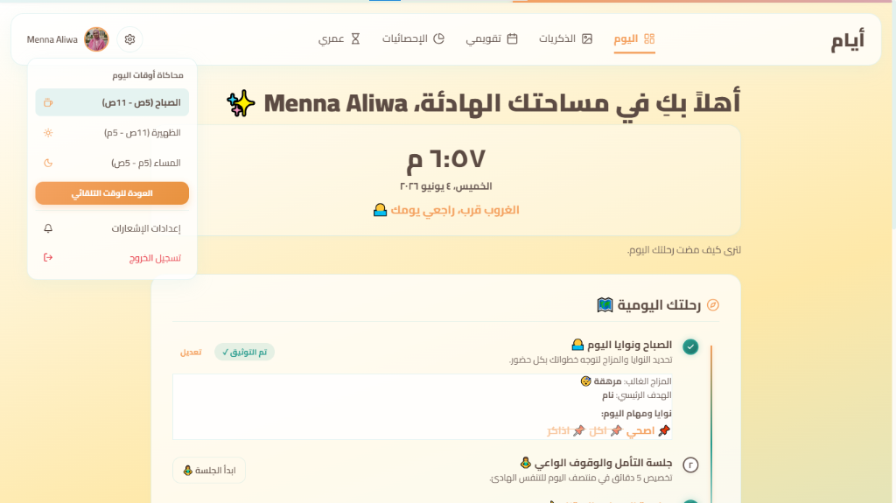

<div align="center">



<br />

# 🌿 أيام — تطبيق اليقظة الذهنية والامتنان اليومي

**مساحة رقمية تأملية باللغة العربية، تُرافق يومك من أوله لآخره بوعي، هدوء، وامتنان.**

<br />

[](https://days-app-ar.vercel.app)
[](https://react.dev)
[](https://firebase.google.com)
[](https://vercel.com)

</div>

---

## 📖 عن المشروع

**أيام** هو تطبيق ويب تفاعلي متكامل، مبني بالكامل باللغة العربية، مصمم لمن يريد أن يعيش تفاصيل حياته بحضور ذهني حقيقي.

على عكس تطبيقات الإنتاجية التقليدية التي تولّد التوتر والضغط، يأخذ **أيام** مسلكاً مختلفاً تماماً: يُذكّرك بالتنفس قبل التخطيط، ويحتفي بلحظاتك الصغيرة قبل الإنجازات الكبيرة، ويقيس رحلتك بمقياس امتنانك وسلامك الداخلي، لا بعدد مهامك المنجزة.

> *"ليست الأيام الكبيرة وحدها هي التي تصنع حياة جميلة — بل طريقة عيش أيامك العادية."*

---

## ✨ الميزات الأساسية

### 🌅 الرحلة اليومية الثلاثية
محطات ثلاث تُرافق يومك بالكامل:

| المحطة | الوصف |
|---|---|
| **شروق جديد ☀️** | تحديد النوايا، اختيار هدف اليوم، وتسجيل الحالة المزاجية |
| **الوقوف الواعي 🧘** | مؤقت تفاعلي للتنفس (شهيق–حبس–زفير) مع مولد ذبذبات صوتية مدمج بدون ملفات خارجية |
| **مراجعة المساء 🌙** | تدوين اللحظات السعيدة، أسئلة تأملية يومية، وتخطيط هادئ للغد |

---

### 🤖 اقتباسات مخصصة بالذكاء الاصطناعي
يُولّد التطبيق اقتباساً تأملياً يومياً مخصصاً بناءً على **اسمك + مزاجك + هدف يومك**، معتمداً على:
- **Groq API (Llama 3.1 8B)** — أداء سريع ومجاني
- **Gemini API** — كبديل احتياطي
- نظام قوالب ذكي offline لضمان الاستمرارية

---

### 🔥 نظام الستريك التشجيعي
- يحسب أيام الالتزام المتتالية بدقة مع **فترة سماح** ليوم كامل
- عند انكسار الستريك: رسائل دعم وتشجيع، لا عقاب ولا توتر
- مقارنة أسبوعية لتحفيز الاستمرار

---

### 📸 صندوق الذكريات السحابي
- تدوين اللحظات السعيدة مع صورها
- ضغط ذكي تلقائي للصور (Canvas-based) للملفات الكبيرة
- رفع فوري عبر **Cloudinary** بدون انتظار

---

### 📊 لوحة التحليلات الذكية
- **منحنى المشاعر:** رسم بياني SVG يعرض تقلبات مزاجك خلال 7 أو 30 يوماً
- **سحابة الامتنان:** الكلمات الأكثر تكراراً في تدويناتك المسائية
- **مؤشرات الالتزام:** نسب الحضور والانتظام الأسبوعي والشهري

---

### 🗓️ التقويم والمناسبات
- عداد تقدم سنوي يُظهر ما مضى وما تبقى من العام
- مناسبات شخصية مخصصة مع عداد تنازلي (أعياد، ذكريات، أهداف)

---

### 🧠 صفحة أسابيع العمر
- عرض كامل لأسابيع حياتك على شكل شبكة بصرية
- تلوين ديناميكي يعكس تقدمك في رحلة الحياة
- يُحفّز على قيمة الوقت واستثماره بوعي

---

### 🛡️ الملجأ — صندوق الإسعافات النفسية
مساحة طوارئ للتعامل مع لحظات التوتر والقلق:
- **تمرين الحواس الخمس** (Grounding 5-4-3-2-1): مرشد تفاعلي خطوة بخطوة
- **تنفس 4-7-8**: نمط تنفس علمي لتهدئة الجهاز العصبي
- **بطاقات طمأنينة** بصرية مع عبارات مهدئة
- **تفريغ القلق** (Worry Dump & Fade): فضاء آمن لكتابة الأفكار وإطلاقها

---

## 🛠️ التقنيات المستخدمة

```
Frontend       →  React 18 + Vite 6, JavaScript ES2024
Styling        →  Vanilla CSS — Glassmorphism + Micro-animations (RTL First)
Database       →  Firebase Firestore (NoSQL Cloud Database)
Auth           →  Firebase Authentication (Google OAuth)
Media          →  Cloudinary (صور الذكريات)
AI             →  Groq API (Llama 3.1 8B) + Gemini API
Hosting        →  Vercel (CI/CD تلقائي من GitHub)
Offline Mode   →  LocalStorage Mock Mode (يعمل بدون إعداد)
Audio          →  Web Audio API (توليد ذبذبات صوتية مدمجة)
```

---

## 🔒 أمان البيانات ومتغيرات البيئة

جميع المفاتيح الحساسة محمية داخل متغيرات البيئة ومحظور رفعها عبر `.gitignore`.

```bash
# نسخ القالب
cp .env.example .env
```

```env
# Firebase
VITE_FIREBASE_API_KEY=your_firebase_api_key
VITE_FIREBASE_AUTH_DOMAIN=your_project.firebaseapp.com
VITE_FIREBASE_PROJECT_ID=your_project_id
VITE_FIREBASE_STORAGE_BUCKET=your_project.appspot.com
VITE_FIREBASE_MESSAGING_SENDER_ID=your_messaging_sender_id
VITE_FIREBASE_APP_ID=your_app_id

# Cloudinary (لرفع صور الذكريات)
VITE_CLOUDINARY_CLOUD_NAME=your_cloudinary_cloud_name
VITE_CLOUDINARY_UPLOAD_PRESET=your_cloudinary_preset

# AI APIs
VITE_GROQ_API_KEY=your_groq_api_key
VITE_GEMINI_API_KEY=your_gemini_api_key
```

> **ملاحظة:** يعمل التطبيق في وضع تجريبي (Mock Mode) كامل بدون أي مفاتيح، باستخدام LocalStorage فقط.

---

## 🚀 تشغيل المشروع محلياً

تأكد من تثبيت [Node.js v18+](https://nodejs.org) على جهازك.

```bash
# 1. استنساخ المستودع
git clone https://github.com/mna80455-debug/days.git
cd days

# 2. تثبيت التبعيات
npm install

# 3. تشغيل بيئة التطوير
npm run dev

# 4. بناء النسخة الإنتاجية
npm run build
```

---

## 📁 هيكل المشروع

```
src/
├── components/          # المكونات المشتركة (Layout, ProtectedRoute)
├── context/             # ThemeContext, AuthContext
├── firebase/            # إعدادات Firebase + notifications
├── pages/
│   ├── Dashboard.jsx    # لوحة التحكم الرئيسية
│   ├── Morning.jsx      # شروق جديد (الصباح)
│   ├── Evening.jsx      # مراجعة المساء
│   ├── Calendar.jsx     # التقويم والمناسبات
│   ├── Habits.jsx       # عاداتي اليومية
│   ├── Memories.jsx     # صندوق الذكريات
│   ├── LifeWeeks.jsx    # أسابيع العمر
│   ├── Statistics.jsx   # لوحة التحليلات
│   ├── Refuge.jsx       # الملجأ (إسعافات نفسية)
│   ├── Settings.jsx     # الإعدادات
│   └── Login.jsx        # تسجيل الدخول
└── index.css            # نظام التصميم الكامل (CSS Variables + Glassmorphism)
```

---

## 📄 الرخصة

هذا المشروع خاص وجميع حقوقه محفوظة.  
لا يُسمح بإعادة التوزيع أو النسخ أو الاستخدام التجاري دون إذن صريح من صاحب المشروع.

© 2025 أيام — جميع الحقوق محفوظة.

---

<div align="center">

صُنع بـ 🤍 وقهوة كثيرة — **أيام**

</div>
